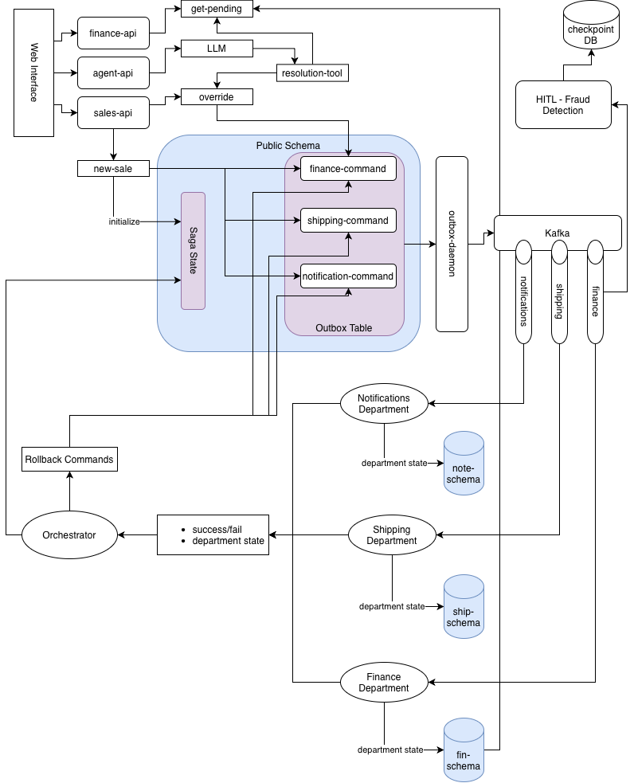

## 📝 System Introduction & Architecture Overview

The Tshirt Enterprise Platform is an e-commerce backend built around an asynchronous, event-driven state machine. At its core, the platform utilizes a **Hybrid Schema-Isolated Outbox Pattern** to enforce strict **Database-per-Service** isolation boundaries while radically simplifying distributed data pipelines. When a consumer initiates a checkout request, the `Sales API` coordinates an atomic transaction that records the business state inside its private domain schema namespace, writes matching command envelopes to a centralized `public` log table, and releases control instantly. A single-instance `Universal Outbox Daemon` continuously polls this shared-log workspace, wraps active W3C traceparents to preserve distributed openTelemetry visibility, and emits the message bytes onto Apache Kafka topics where independent downstream worker services consume them to mutate their own private accounting ledgers.

To achieve this level of system reliability and cross-domain consistency, the platform relies on several key technology and design choices:
* **SQLAlchemy 2.0 Core Table Layering**: By switching the shared outbox utility to an abstract Core table definition, we gained complete cross-dialect database stability. Local unit test suites execute against ultra-fast in-memory SQLite canvases (`sqlite:///:memory:`), while production-grade container pods scale across a multi-tenant PostgreSQL schema topology without relying on complex, global engine-level query intercept rules.
* **LangGraph-Powered Asynchronous State Workflows**: Complex business policies—such as the human-in-the-loop fraud analysis locks within the `Finance Worker` or geographical compliance tracks inside the `Shipping Worker`—are managed through modular LangGraph state machines. This setup lets nodes invoke explicit, synchronous `db.commit()` checks right before an `interrupt()` statement freezes the execution loop, preserving pure database transaction states while allowing background SQLite checkpointers to persist thread-safe snapshots out-of-band.
* **Centralized Saga Orchestration & Compensations**: Cross-service data integrity is guided by the `Sales Saga Orchestrator`. It consumes real-time worker checkpoints from a unified `saga_replies` topic to tick off its orchestration checklist logs. If any department hits a legal restriction block or fraud hold, the Orchestrator marks the global state as rejected and stages targeted compensation cancellation commands back into the central outbox log, triggering an immediate rollback sequence across all other active department nodes to release held resources on the very first pass.
## 🧱 Core Business Rules & Distributed Saga Rollbacks

The platform enforces two strict business compliance boundaries during the forward fulfillment loop. If either check fails, the platform fires an automated compensation protocol to maintain eventual consistency across all isolated data domains:

1. **Automated Geographical Compliance Check (`Shipping Worker`)**: The Shipping Worker scans the incoming order's destination address attributes. If the target location matches a legally restricted zone (such as the State of Michigan), the worker halts processing immediately, flags the order as rejected inside its private `shipping_domain` schema, and emits a failure signal back to the platform.
2. **Algorithmic Risk Threshold Check (`Finance Worker`)**: The Finance Worker evaluates the total transaction amount. Orders under \$200 are approved automatically, while orders exceeding \$200 trigger a risk hold that diverts the transaction path into a separate Human-in-the-Loop review loop. If an operator rejects the transaction during this review, the worker issues a rejection reply to the system.

---

### 🔄 The Cascading Compensation Lifecycle

When a business rule causes a department to reject a transaction, the platform triggers a centralized state-unwinding sequence [1.1]:

```text
[Worker Failure Node] 
         |
         v (Writes 'FAILED' Control Token)
   public.platform_outbox
         |
         v (Daemon Streams)
    saga_replies (Kafka)
         |
         v (Ingests & Rejects)
   Sales Saga Orchestrator 
         |
         +-------------------------------------------------------------+

         | (Generates Compensations)                                   |
         v                                                             v
   finance_commands (Kafka)                                     shipping_commands (Kafka)

         |                                                             |
         v (Releases held credits)                                     v (Erases freight routes)
   finance_domain.finance_ledger                                 shipping_domain.shipping_ledger
```

1. **Failure Ingestion**: The rejecting service worker commits its descriptive error details to its private ledger, packages a standardized saga contract with a rigid `FAILED` wire status token, and writes it directly to the centralized `public.platform_outbox` table log [1.1].
2. **Daemon Dispatch**: The single-instance `Universal Outbox Daemon` polls the row, attaches the openTelemetry trace headers, and streams the payload onto the `saga_replies` Kafka topic.
3. **Orchestrator Evaluation**: The `Sales Saga Orchestrator` consumes the reply from Kafka. Detecting the `FAILED` wire status, the orchestrator updates the tracking logs inside `sales_domain.saga_state_tracker` and marks the global transaction status as `REJECTED`. 
4. **Compensation Generation**: The orchestrator generates targeted compensation commands for *every other active department* involved in the transaction. It drops these `CANCEL_TRANSACTION` envelopes straight back into the central `public.platform_outbox` table.
5. **Walled-Off Service Rollbacks**: The daemon streams these compensation commands across the respective Kafka channels (`finance_commands`, `shipping_commands`, `notifications_commands`). The sibling worker services ingest the cancellation payload, route the transaction straight to their internal compensation nodes, and execute safe rollbacks within their private data schemas (e.g., releasing credit line allocations or clearing reserved freight routes), freeing up cluster resources [1.1].

## 🧑‍✈️ Human-in-the-Loop (HITL) Fraud Analysis Circuit

High-value transactions processed by the platform undergo an automated risk evaluation path that integrates Human-in-the-Loop (HITL) review holds without blocking reactive event loops.

```text
                  [Amount > \$200]
Finance Department -------------> [ LangGraph interrupt() ]

       |                                   |
       v (Writes State)                    v (Saves Checkpoint)
 finance_domain.ledger          finance_checkpoints.sqlite
                                           |
                                           v (Operator Review)
 public.platform_outbox <----------------- [ Manual Override ]
```

### 1. State Suspension & Checkpointer Isolation
When the `Finance Worker` encounters an order exceeding \$200, it records a `PENDING_HUMAN_REVIEW` entry inside its private `finance_domain.finance_ledger` table and calls an explicit `db.commit()` to make the hold visible to internal web dashboards. It immediately invokes a LangGraph `interrupt()`, suspending the execution thread loop on the spot. 

The graph framework captures and snapshots the complete, active variable matrix into an isolated, file-based SQLite database (`finance_checkpoints.sqlite`). This checkpointer engine operates independently of the central PostgreSQL connection pool, ensuring suspended threads never lock or compromise relational database connections.

### 2. Operational API Interrogation & Resumption
* **Review Discovery**: The operations automation agent uses the programmatic `finance-api` endpoint (`/finance/reviews/pending`) to scan the private database ledger and pull an array of all order UUIDs currently frozen under review flags.
* **Verdict Injection**: When an operator issues a verdict (`APPROVE` or `REJECT`) via the UI, a payload hits the sales gateway, which drops a decision token back onto the message bus. The Finance worker picks up the signal, opens its checkpointer context, and feeds a `Command(resume=verdict)` straight into the graph loop to rehydrate and resume the frozen thread.

### 3. Cross-Boundary Event Resolution
The moment the thread resumes, the final graph nodes execute their resolution tasks. The worker updates its business record inside the private `finance_domain` schema, packages the standard saga contract response, and writes it directly to the shared `public.platform_outbox` table. This allows the centralized daemon to stream the reply back to the `Saga Orchestrator` to complete or roll back the global transaction loop.

## 🗄️ Multi-Tenant Database Schema Isolation Matrix

To enforce clean **Database-per-Service** isolation while minimizing infrastructure footprint, all microservices share a single PostgreSQL database instance but execute within strictly isolated, logical database schemas:

| Logical Database Schema Workspace | Target Service / Component | Contained Database Table Blueprints |
| :--- | :--- | :--- |
| **`public`** *(Central Shared-Log Workspace)* | Universal Outbox Daemon / All Services | `platform_outbox` (Abstract Core transactional log) |
| **`sales_domain`** | Sales Order Ingress API / Saga Engine | `customers`, `invoices`, `saga_state_tracker` |
| **`finance_domain`** | Finance Auditing Worker Service | `finance_ledger` (LangGraph checkpointed assets) |
| **`shipping_domain`** | Shipping Fulfillment Worker Service | `shipping_ledger` (Geographical route compliance) |
| **`notifications_domain`** | Customer Messaging Alert Worker | `communication_ledger` (Broadcast logs) |

## 📡 Apache Kafka Event Distribution Backbone & Avro Contracts

As illustrated in the architecture blueprint, **Apache Kafka** serves as the central, high-throughput event distribution backbone for the entire platform. Rather than using tight, synchronous HTTP couplings, microservices communicate entirely out-of-band by publishing and consuming message streams across decoupled Kafka topics. 

To guarantee strict API data contract compatibility across these asynchronous streams, the platform rejects plain, untyped JSON strings [1.1]. All events are serialized into binary formats using **Apache Avro** and validated on-the-fly against a centralized **Confluent Schema Registry** sidecar [1.1]:

* **`finance_commands`**: Enforces the `command_envelope.avsc` binary schema contract. Kafka routes `NEW_SALE` forward transaction signals or `CANCEL_TRANSACTION` rollbacks directly into the Finance LangGraph pipeline.
* **`shipping_commands`**: Validates destination address primitives against the universal command envelope schema to feed geographical metadata into the Shipping Worker's topic channel.
* **`notifications_commands`**: Streams strongly-typed messaging triggers across Kafka to fire welcome invoices or order cancellation alert emails out-of-band.
* **`saga_replies`**: The central feedback loop topic. Sibling workers broadcast their responses back to this channel, adhering to the strict `saga_reply.avsc` contract. They must provide a rigid, uppercase indicator string (`SUCCESS` or `FAILED`) alongside an explicit description of their internal database ledger states [1.1]. The Sales Saga Orchestrator polls this Kafka topic to safely coordinate global check-offs or trigger compensation runs [1.1].

## 🚀 Getting Started

This section outlines the steps required to provision the local cluster fabric, run testing validation pipelines, and monitor the live service mesh.

### 📋 Prerequisites

Before bootstrapping the platform, ensure your local hardware layer has the following foundational tools installed:

* **Docker Desktop**: Required to host node containers.
* **Python 3.12+ / uv**: Used for running the test runner frameworks.
* **kubectl**: The standard CLI tool used to interact with the active cluster control plane.

#### 🍏 macOS Setup
Install the complete toolchain via Homebrew:
```bash
brew install docker kind kubectl uv
```


#### 🪟 Windows Setup
* **WSL 2 (Windows Subsystem for Linux)**: Must be enabled on your machine.
* **Docker Desktop**: Download the installer and ensure **"Use the WSL 2 based engine"** is checked in Settings.
* Install `kind`, `kubectl`, and `uv` using the Windows Package Manager (Winget):
```cmd
winget install Kubernetes.kind
winget install Kubernetes.kubectl
winget install astral-sh.uv
```

---

### 🛠️ Execution & Deployment Commands

The project root contains a unified `Makefile` that abstracts cluster orchestration, image sideloading, and testing suites.

#### 1. Inspect Available Automation Targets
View the centralized documentation matrix tracking all valid software compilation commands:
```bash
make help
```

#### 2. Bootstrap the Local Cluster Stack
Initialize the virtual network namespace, side-load pre-cached image layers, mount storage volumes, execute schema scripts, and boot the entire platform mesh sequentially:
```bash
make kube-platform-start
```

#### 3. Verify Multi-Runtime Platform Status
Check your live terminal dashboard to confirm that all container replicas register online and that network ingress tunnels are securely bridged to your host network interface:
```bash
make system-status
```

#### 4. Run the Validation Testing Suites
Execute isolated local unit tests or launch full end-to-end integration test streams over the active cluster network:
```bash
# Run all fast, local host unit tests (uses in-memory SQLite canvases)
make test-all

# Run complete distributed integration tests across active cluster components
make test-integration
```
### 🔄 Running a Live System Simulation

To see the platform actively process e-commerce orders, route events through Kafka, and handle distributed state machines, you can run a live traffic simulation.

#### 1. Launch the Traffic Generator
Open a new terminal pane and execute the background workload simulator to feed continuous checkout events into the gateway pipeline:
```bash
./scripts/simulate.sh load
```

#### 2. Open the Administrative Dashboard
Once the simulation is running, open your web browser and navigate to the platform's local web server interface:
```text
http://localhost:8000
```

From this dashboard interface, you can watch real-time order completions, monitor active saga checkout checklists, trace distributed telemetry events, and interact directly with the manual operational hold desks.

## 🔬 Observability & Telemetry Tracing

The platform is wired with native **OpenTelemetry** hooks that preserve execution context across thread pools, network boundaries, and messaging brokers. 

Every e-commerce checkout request generates a unique distributed trace parent context that flows from the Sales API, into the outbox logs, over Apache Kafka, and right through individual LangGraph state nodes.

### 📊 Accessing the Distributed Trace Viewer

To inspect runtime execution latencies, trace multi-service dependencies, and verify transaction boundaries, open your web browser and navigate to the centralized Jaeger dashboard:
```text
http://localhost:16686
```

#### 🔎 Key Tracing Milestones to Look For:
* `http_create_sale_request`: Captures the initial ingress REST execution loop on the FastAPI gateway.
* `outbox_dispatch_platform_outbox`: Traces the precise microsecond the single-instance daemon sweeps the log table and rehydrates the traceparent context.
* `langgraph_evaluate_fraud_risk`: Measures the state execution duration of individual business logic nodes right before a human-in-the-loop suspension path triggers.

## 🔬 Observability & Telemetry Tracing

The platform is wired with native **OpenTelemetry** hooks that preserve execution context across thread pools, network boundaries, and messaging brokers. 

Every e-commerce checkout request generates a unique distributed trace parent context that flows from the Sales API, into the outbox logs, over Apache Kafka, and right through individual LangGraph state nodes.

### 📊 Accessing the Distributed Trace Viewer

To inspect runtime execution latencies, trace multi-service dependencies, and verify transaction boundaries, open your web browser and navigate to the centralized Jaeger dashboard:
```text
http://localhost:16686
```

#### 🔎 Key Tracing Milestones to Look For:
* `http_create_sale_request`: Captures the initial ingress REST execution loop on the FastAPI gateway.
* `outbox_dispatch_platform_outbox`: Traces the precise microsecond the single-instance daemon sweeps the log table and rehydrates the traceparent context.
* `langgraph_evaluate_fraud_risk`: Measures the state execution duration of individual business logic nodes right before a human-in-the-loop suspension path triggers.


## 📡 Messaging Bus Event Topic Registry

All cross-domain communications and state checkpoints compile against case-insensitive Avro schema contract models and stream across the following Apache Kafka channels:

* **`finance_commands`**: Ingests `NEW_SALE` forward transaction contracts and `CANCEL_TRANSACTION` operational rollbacks into the Finance LangGraph pipeline.
* **`shipping_commands`**: Feeds destination metadata profiles into the Shipping Worker to run geographical routing checks.
* **`notifications_commands`**: Dispatches messaging triggers to fire welcome invoices or order cancellation email updates out-of-band.
* **`saga_replies`**: The central feedback loop. All workers broadcast their descriptive ledger states and binary indicators to this channel, which the Sales Saga Orchestrator polls to coordinate global check-offs or trigger compensation runs.
